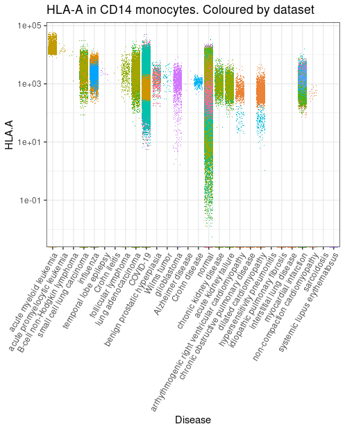
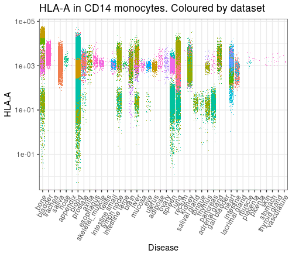

CuratedAtlasQueryR
================

<!-- badges: start -->

[](https://www.tidyverse.org/lifecycle/#maturing)
<!-- badges: end -->

`CuratedAtlasQuery` is a query interface that allow the programmatic
exploration and retrieval of the harmonised, curated and reannotated
CELLxGENE single-cell human cell atlas. Data can be retrieved at cell,
sample, or dataset levels based on filtering criteria.


[website](https://stemangiola.github.io/CuratedAtlasQueryR)

# Query interface

## Installation

``` r
devtools::install_github("stemangiola/CuratedAtlasQueryR")
```

## Load the package

``` r
library(CuratedAtlasQueryR)
```

## Load and explore the metadata

### Load the metadata

``` r
metadata  = get_metadata()

metadata
#> # Source:   table</vast/scratch/users/milton.m/cache/R/CuratedAtlasQueryR/metadata.0.2.3.parquet> [?? x 56]
#> # Database: DuckDB 0.6.2-dev1166 [unknown@Linux 3.10.0-1160.81.1.el7.x86_64:R 4.2.1/:memory:]
#>    cell_ sample_ cell_…¹ cell_…² confi…³ cell_…⁴ cell_…⁵ cell_…⁶ sampl…⁷ _samp…⁸
#>    <chr> <chr>   <chr>   <chr>     <dbl> <chr>   <chr>   <chr>   <chr>   <chr>  
#>  1 AAAC… 689e2f… basal … basal_…       1 <NA>    <NA>    <NA>    f297c7… D17PrP…
#>  2 AAAC… 689e2f… basal … basal_…       1 <NA>    <NA>    <NA>    f297c7… D17PrP…
#>  3 AAAC… 689e2f… lumina… lumina…       1 <NA>    <NA>    <NA>    930938… D17PrP…
#>  4 AAAC… 689e2f… lumina… lumina…       1 <NA>    <NA>    <NA>    930938… D17PrP…
#>  5 AAAC… 689e2f… basal … basal_…       1 <NA>    <NA>    <NA>    f297c7… D17PrP…
#>  6 AAAC… 689e2f… basal … basal_…       1 <NA>    <NA>    <NA>    f297c7… D17PrP…
#>  7 AAAC… 689e2f… basal … basal_…       1 <NA>    <NA>    <NA>    f297c7… D17PrP…
#>  8 AAAC… 689e2f… basal … basal_…       1 <NA>    <NA>    <NA>    f297c7… D17PrP…
#>  9 AAAC… 689e2f… lumina… lumina…       1 <NA>    <NA>    <NA>    930938… D17PrP…
#> 10 AAAC… 689e2f… basal … basal_…       1 <NA>    <NA>    <NA>    f297c7… D17PrP…
#> # … with more rows, 46 more variables: assay <chr>,
#> #   assay_ontology_term_id <chr>, file_id_db <chr>,
#> #   cell_type_ontology_term_id <chr>, development_stage <chr>,
#> #   development_stage_ontology_term_id <chr>, disease <chr>,
#> #   disease_ontology_term_id <chr>, ethnicity <chr>,
#> #   ethnicity_ontology_term_id <chr>, experiment___ <chr>, file_id <chr>,
#> #   is_primary_data_x <chr>, organism <chr>, organism_ontology_term_id <chr>, …
```

### Explore the number of datasets per tissue

``` r
metadata |>
  dplyr::distinct(tissue, dataset_id) |> 
  dplyr::count(tissue)
#> # Source:   SQL [?? x 2]
#> # Database: DuckDB 0.6.2-dev1166 [unknown@Linux 3.10.0-1160.81.1.el7.x86_64:R 4.2.1/:memory:]
#>    tissue            n
#>    <chr>         <dbl>
#>  1 cerebellum        3
#>  2 telencephalon     2
#>  3 heart             3
#>  4 intestine        18
#>  5 kidney           19
#>  6 liver            24
#>  7 lung             27
#>  8 muscle organ      3
#>  9 pancreas          5
#> 10 placenta          3
#> # … with more rows
```

## Download single-cell RNA sequencing counts

### Query raw counts

``` r

single_cell_counts = 
    metadata |>
    dplyr::filter(
        ethnicity == "African" &
        stringr::str_like(assay, "%10x%") &
        tissue == "lung parenchyma" &
        stringr::str_like(cell_type, "%CD4%")
    ) |>
    get_SingleCellExperiment()
#> ℹ Realising metadata.
#> ℹ Synchronising files
#> ℹ Reading files.
#> ℹ Compiling Single Cell Experiment.

single_cell_counts
#> class: SingleCellExperiment 
#> dim: 36229 1571 
#> metadata(0):
#> assays(1): counts
#> rownames(36229): A1BG A1BG-AS1 ... ZZEF1 ZZZ3
#> rowData names(0):
#> colnames(1571): ACAGCCGGTCCGTTAA_F02526_1 GGGAATGAGCCCAGCT_F02526_1 ...
#>   TACAACGTCAGCATTG_SC84_1 CATTCGCTCAATACCG_F02526_1
#> colData names(56): sample_ cell_type ... updated_at_y original_cell_id
#> reducedDimNames(0):
#> mainExpName: NULL
#> altExpNames(0):
```

### Query counts scaled per million

This is helpful if just few genes are of interest, as they can be
compared across samples.

``` r
single_cell_counts = 
    metadata |>
    dplyr::filter(
        ethnicity == "African" &
        stringr::str_like(assay, "%10x%") &
        tissue == "lung parenchyma" &
        stringr::str_like(cell_type, "%CD4%")
    ) |>
    get_SingleCellExperiment(assays = "cpm")
#> ℹ Realising metadata.
#> ℹ Synchronising files
#> ℹ Reading files.
#> ℹ Compiling Single Cell Experiment.

single_cell_counts
#> class: SingleCellExperiment 
#> dim: 36229 1571 
#> metadata(0):
#> assays(1): cpm
#> rownames(36229): A1BG A1BG-AS1 ... ZZEF1 ZZZ3
#> rowData names(0):
#> colnames(1571): ACAGCCGGTCCGTTAA_F02526_1 GGGAATGAGCCCAGCT_F02526_1 ...
#>   TACAACGTCAGCATTG_SC84_1 CATTCGCTCAATACCG_F02526_1
#> colData names(56): sample_ cell_type ... updated_at_y original_cell_id
#> reducedDimNames(0):
#> mainExpName: NULL
#> altExpNames(0):
```

### Extract only a subset of genes

``` r
single_cell_counts = 
    metadata |>
    dplyr::filter(
        ethnicity == "African" &
        stringr::str_like(assay, "%10x%") &
        tissue == "lung parenchyma" &
        stringr::str_like(cell_type, "%CD4%")
    ) |>
    get_SingleCellExperiment(assays = "cpm", features = "PUM1")
#> ℹ Realising metadata.
#> ℹ Synchronising files
#> ℹ Reading files.
#> ℹ Compiling Single Cell Experiment.

single_cell_counts
#> class: SingleCellExperiment 
#> dim: 1 1571 
#> metadata(0):
#> assays(1): cpm
#> rownames(1): PUM1
#> rowData names(0):
#> colnames(1571): ACAGCCGGTCCGTTAA_F02526_1 GGGAATGAGCCCAGCT_F02526_1 ...
#>   TACAACGTCAGCATTG_SC84_1 CATTCGCTCAATACCG_F02526_1
#> colData names(56): sample_ cell_type ... updated_at_y original_cell_id
#> reducedDimNames(0):
#> mainExpName: NULL
#> altExpNames(0):
```

### Extract the counts as a Seurat object

This convert the H5 SingleCellExperiment to Seurat so it might take long
time and occupy a lot of memory depending on how many cells you are
requesting.

``` r
single_cell_counts = 
    metadata |>
    dplyr::filter(
        ethnicity == "African" &
        stringr::str_like(assay, "%10x%") &
        tissue == "lung parenchyma" &
        stringr::str_like(cell_type, "%CD4%")
    ) |>
    get_seurat()
#> ℹ Realising metadata.
#> ℹ Synchronising files
#> ℹ Reading files.
#> ℹ Compiling Single Cell Experiment.

single_cell_counts
#> An object of class Seurat 
#> 36229 features across 1571 samples within 1 assay 
#> Active assay: originalexp (36229 features, 0 variable features)
```

## Save your `SingleCellExperiment`

The returned `SingleCellExperiment` can be saved with two modalities, as
`.rds` or as `HDF5`.

### Saving as RDS (fast saving, slow reading)

Saving as `.rds` has the advantage that is very fast, the `.rds` file
occupies very little disk space as it only stored the links for the
files in your ache.

However it has the disadvantage that for big `SingleCellExperiment`
objects, which merge a lot of HDF5 from your `get_SingleCellExperiment`
the display and manipulation is going to be slow.

``` r
single_cell_counts |> saveRDS("single_cell_counts.rds")
```

### Saving as HDF5 (slow saving, fast reading)

Saving as `.rds` has the advantage that rewrites on disk a monolithic
`HDF5` and so displaying and manipulating large `SingleCellExperiment`
objects, which merge a lot of HDF5 from your `get_SingleCellExperiment`,
is going to be fast.

However it has the disadvantage that the files are going to be larger as
they include the count information, and the saving process is going to
be slow for large objects.

``` r
single_cell_counts |> saveHDF5SummarizedExperiment("single_cell_counts")
```

## Visualise gene transcription

We can gather all CD14 monocytes cells and plot the distribution of
HLA-A across all tissues

``` r
library(tidySingleCellExperiment)
library(ggplot2)

metadata |>
  # Filter and subset
  filter(cell_type_harmonised=="cd14 mono") |>

  # Get counts per million for HCA-A gene
  get_SingleCellExperiment(assays = "cpm", features = "HLA-A") |> 
  
  # Plot (styling code have been omitted)
  join_features("HLA-A", shape = "wide") |> 
  ggplot(aes( disease, `HLA.A`,color = file_id)) +
  geom_jitter(shape=".") 
```



``` r

metadata |> 
    
  # Filter and subset
  filter(cell_type_harmonised=="nk") |> 

  # Get counts per million for HCA-A gene 
  get_SingleCellExperiment(assays = "cpm", features = "HLA-A") |> 

    # Plot (styling code have been omitted)
  join_features("HLA-A", shape = "wide") |> 
  ggplot(aes( tissue_harmonised, `HLA.A`,color = file_id)) +
  geom_jitter(shape=".") 
```



## Obtain Unharmonised Metadata

Various metadata fields are *not* common between datasets, so it does
not make sense for these to live in the main metadata table. However, we
can obtain it using the `get_unharmonised_metadata()` function. This
function returns a data frame with one row per dataset, including the
`unharmonised` column which contains unharmnised metadata as a nested
data frame.

``` r
harmonised <- get_metadata() |> dplyr::filter(tissue == "kidney blood vessel")
unharmonised <- get_unharmonised_metadata(harmonised)
unharmonised
#> # A tibble: 4 × 2
#>   file_id                              unharmonised   
#>   <chr>                                <list>         
#> 1 63523aa3-0d04-4fc6-ac59-5cadd3e73a14 <tbl_dck_[,17]>
#> 2 8fee7b82-178b-4c04-bf23-04689415690d <tbl_dck_[,12]>
#> 3 dc9d8cdd-29ee-4c44-830c-6559cb3d0af6 <tbl_dck_[,14]>
#> 4 f7e94dbb-8638-4616-aaf9-16e2212c369f <tbl_dck_[,14]>
```

Notice that the columns differ between each dataset’s data frame:

``` r
dplyr::pull(unharmonised, unharmonised) |> head(2)
#> [[1]]
#> # Source:   SQL [?? x 17]
#> # Database: DuckDB 0.6.2-dev1166 [unknown@Linux 3.10.0-1160.81.1.el7.x86_64:R 4.2.1/:memory:]
#>    cell_ file_id donor…¹ donor…² libra…³ mappe…⁴ sampl…⁵ suspe…⁶ suspe…⁷ autho…⁸
#>    <chr> <chr>   <chr>   <chr>   <chr>   <chr>   <chr>   <chr>   <chr>   <chr>  
#>  1 4602… 63523a… 27 mon… a8536b… 5ddaea… GENCOD… 61bf84… cell    d8a44f… Pelvic…
#>  2 4602… 63523a… 27 mon… a8536b… 5ddaea… GENCOD… 61bf84… cell    d8a44f… Pelvic…
#>  3 4602… 63523a… 27 mon… a8536b… 5ddaea… GENCOD… 61bf84… cell    d8a44f… Pelvic…
#>  4 4602… 63523a… 27 mon… a8536b… 5ddaea… GENCOD… 61bf84… cell    d8a44f… Pelvic…
#>  5 4602… 63523a… 27 mon… a8536b… 5ddaea… GENCOD… 61bf84… cell    d8a44f… Pelvic…
#>  6 4602… 63523a… 27 mon… a8536b… 5ddaea… GENCOD… 61bf84… cell    d8a44f… Pelvic…
#>  7 4602… 63523a… 27 mon… a8536b… 5ddaea… GENCOD… 61bf84… cell    d8a44f… Pelvic…
#>  8 4602… 63523a… 27 mon… a8536b… 5ddaea… GENCOD… 61bf84… cell    d8a44f… Pelvic…
#>  9 4602… 63523a… 19 mon… 463181… 671785… GENCOD… 125234… cell    c7485e… CD4 T …
#> 10 4602… 63523a… 27 mon… a8536b… 5ddaea… GENCOD… 61bf84… cell    d8a44f… Pelvic…
#> # … with more rows, 7 more variables: cell_state <chr>,
#> #   reported_diseases <chr>, Short_Sample <chr>, Project <chr>,
#> #   Experiment <chr>, compartment <chr>, broad_celltype <chr>, and abbreviated
#> #   variable names ¹​donor_age, ²​donor_uuid, ³​library_uuid,
#> #   ⁴​mapped_reference_annotation, ⁵​sample_uuid, ⁶​suspension_type,
#> #   ⁷​suspension_uuid, ⁸​author_cell_type
#> 
#> [[2]]
#> # Source:   SQL [?? x 12]
#> # Database: DuckDB 0.6.2-dev1166 [unknown@Linux 3.10.0-1160.81.1.el7.x86_64:R 4.2.1/:memory:]
#>    cell_ file_id orig.…¹ nCoun…² nFeat…³ seura…⁴ Project donor…⁵ compa…⁶ broad…⁷
#>    <chr> <chr>   <chr>     <dbl> <chr>   <chr>   <chr>   <chr>   <chr>   <chr>  
#>  1 1069  8fee7b… 4602ST…   16082 3997    25      Experi… Wilms3  non_PT  Pelvic…
#>  2 1214  8fee7b… 4602ST…    1037 606     25      Experi… Wilms3  non_PT  Pelvic…
#>  3 2583  8fee7b… 4602ST…    3028 1361    25      Experi… Wilms3  non_PT  Pelvic…
#>  4 2655  8fee7b… 4602ST…    1605 859     25      Experi… Wilms3  non_PT  Pelvic…
#>  5 3609  8fee7b… 4602ST…    1144 682     25      Experi… Wilms3  non_PT  Pelvic…
#>  6 3624  8fee7b… 4602ST…    1874 963     25      Experi… Wilms3  non_PT  Pelvic…
#>  7 3946  8fee7b… 4602ST…    1296 755     25      Experi… Wilms3  non_PT  Pelvic…
#>  8 5163  8fee7b… 4602ST…   11417 3255    25      Experi… Wilms3  non_PT  Pelvic…
#>  9 5446  8fee7b… 4602ST…    1769 946     19      Experi… Wilms2  lympho… CD4 T …
#> 10 6275  8fee7b… 4602ST…    3750 1559    25      Experi… Wilms3  non_PT  Pelvic…
#> # … with more rows, 2 more variables: author_cell_type <chr>, Sample <chr>, and
#> #   abbreviated variable names ¹​orig.ident, ²​nCount_RNA, ³​nFeature_RNA,
#> #   ⁴​seurat_clusters, ⁵​donor_id, ⁶​compartment, ⁷​broad_celltype
```

# Cell metadata

Dataset-specific columns (definitions available at
cellxgene.cziscience.com)

`cell_count`, `collection_id`, `created_at.x`, `created_at.y`,
`dataset_deployments`, `dataset_id`, `file_id`, `filename`, `filetype`,
`is_primary_data.y`, `is_valid`, `linked_genesets`,
`mean_genes_per_cell`, `name`, `published`, `published_at`,
`revised_at`, `revision`, `s3_uri`, `schema_version`, `tombstone`,
`updated_at.x`, `updated_at.y`, `user_submitted`, `x_normalization`

Sample-specific columns (definitions available at
cellxgene.cziscience.com)

`sample_`, `sample_name`, `age_days`, `assay`, `assay_ontology_term_id`,
`development_stage`, `development_stage_ontology_term_id`, `ethnicity`,
`ethnicity_ontology_term_id`, `experiment___`, `organism`,
`organism_ontology_term_id`, `sample_placeholder`, `sex`,
`sex_ontology_term_id`, `tissue`, `tissue_harmonised`,
`tissue_ontology_term_id`, `disease`, `disease_ontology_term_id`,
`is_primary_data.x`

Cell-specific columns (definitions available at
cellxgene.cziscience.com)

`cell_`, `cell_type`, `cell_type_ontology_term_idm`,
`cell_type_harmonised`, `confidence_class`,
`cell_annotation_azimuth_l2`, `cell_annotation_blueprint_singler`

Through harmonisation and curation we introduced custom column, not
present in the original CELLxGENE metadata

- `tissue_harmonised`: a coarser tissue name for better filtering
- `age_days`: the number of days corresponding to the age
- `cell_type_harmonised`: the consensus call identity (for immune cells)
  using the original and three novel annotations using Seurat Azimuth
  and SingleR
- `confidence_class`: an ordinal class of how confident
  `cell_type_harmonised` is. 1 is complete consensus, 2 is 3 out of four
  and so on.  
- `cell_annotation_azimuth_l2`: Azimuth cell annotation
- `cell_annotation_blueprint_singler`: SingleR cell annotation using
  Blueprint reference
- `cell_annotation_blueprint_monaco`: SingleR cell annotation using
  Monaco reference
- `sample_id_db`: Sample subdivision for internal use
- `file_id_db`: File subdivision for internal use
- `sample_`: Sample ID
- `sample_name`: How samples were defined

# RNA abundance

The `raw` assay includes RNA abundance in the positive real scale (not
transformed with non-linear functions, e.g. log sqrt). Originally
CELLxGENE include a mix of scales and transformations specified in the
`x_normalization` column.

The `cpm` assay includes counts per million.

# Installation and getting-started problems

**Problem:** Default R cache path including non-standard characters
(e.g. dash)

``` r
get_metadata()

# Error in `db_query_fields.DBIConnection()`:
# ! Can't query fields.
# Caused by error:
# ! Parser Error: syntax error at or near "/"
# LINE 2: FROM /Users/bob/Library/Cach...
```

**Solution:** Setup custom cache path (e.g. user home directory)

``` r
get_metadata(cache_directory = path.expand('~'))
```

**Problem:** namespace ‘dbplyr’ 2.2.1 is being loaded, but \>= 2.3.0 is
required

**Solution:** Install new dbplyr

``` r
install.packages("dbplyr")
```

------------------------------------------------------------------------

This project has been funded by

- *Silicon Valley Foundation* CZF2019-002443
- *Bioconductor core funding* NIH NHGRI 5U24HG004059-18
- *Victoria Cancer Agency* ECRF21036
- *Australian National Health and Medical Research Council* 1116955
- *The Lorenzo and Pamela Galli Medical Research Trust*
