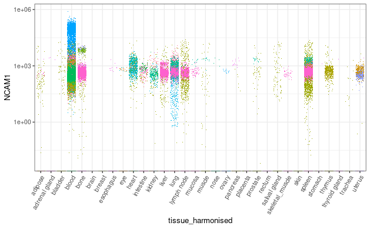

<!-- badges: start -->
[](https://www.tidyverse.org/lifecycle/#maturing)
<!-- badges: end -->

`CuratedAtlasQuery` is a query interface that allow the programmatic exploration and retrieval of the harmonised, curated and reannotated CELLxGENE single-cell human cell atlas. Data can be retrieved at cell, sample, or dataset levels based on filtering criteria. 

```{r, include = FALSE}
# Note: knit this to the repo readme file using:
# rmarkdown::render("vignettes/readme.Rmd", output_format = "github_document", output_dir = getwd())
knitr::opts_chunk$set(
    collapse = TRUE,
    comment = "#>"
)
```

```{r, echo=FALSE, out.height = c("139px"), out.width = "120x" }
knitr::include_graphics(c("../inst/logo.png"))
```

```{r, echo=FALSE, out.height = c("58px"), out.width = c("155x", "129px", "202px", "219px")}
knitr::include_graphics(c(
  "../inst/svcf_logo.jpeg", 
  "../inst/czi_logo.png", 
  "../inst/bioconductor_logo.jpg",
    "../inst/vca_logo.png"
))
```

# Query interface

## Installation

```{r, eval=FALSE}
devtools::install_github("stemangiola/CuratedAtlasQueryR")
```

## Load the package

```{r, message=FALSE, warning=FALSE}
library(CuratedAtlasQueryR)
library(dplyr)
library(stringr)
```

## Load and explore the metadata

### Load the metadata

```{r}
meta <- get_metadata()
```

The `meta` variable can then be re-used for all subsequent queries.

### Explore the tissue 

```{r, eval=FALSE}
meta |>
    dplyr::distinct(tissue, file_id) 
```

```{r}
#> # Source:     SQL [?? x 2]
#> # Database:   sqlite 3.40.0 [public_access@zki3lfhznsa.db.cloud.edu.au:5432/metadata]
#> # Ordered by: desc(n)
#>    tissue                      n
#>    <chr>                 <int64>
#>  1 blood                      47
#>  2 heart left ventricle       46
#>  3 cortex of kidney           31
#>  4 renal medulla              29
#>  5 lung                       27
#>  6 liver                      24
#>  7 middle temporal gyrus      24
#>  8 kidney                     19
#>  9 intestine                  18
#> 10 thymus                     17
#> # … with more rows
```


## Download single-cell RNA sequencing counts 

### Query raw counts

```{r}

single_cell_counts = 
	meta |>
    dplyr::filter(
        ethnicity == "African" &
        stringr::str_like(assay, "%10x%") &
        tissue == "lung parenchyma" &
        stringr::str_like(cell_type, "%CD4%")
    ) |>
    get_SingleCellExperiment()

single_cell_counts
```

### Query counts scaled per million

This is helpful if just few genes are of interest, as they can be compared across samples.

```{r}
single_cell_counts = 
	meta |>
    dplyr::filter(
        ethnicity == "African" &
        stringr::str_like(assay, "%10x%") &
        tissue == "lung parenchyma" &
        stringr::str_like(cell_type, "%CD4%")
    ) |>
    get_SingleCellExperiment(assays = "cpm")

single_cell_counts
```

### Extract only a subset of genes

```{r}
single_cell_counts = 
	meta |>
    dplyr::filter(
        ethnicity == "African" &
        stringr::str_like(assay, "%10x%") &
        tissue == "lung parenchyma" &
        stringr::str_like(cell_type, "%CD4%")
    ) |>
    get_SingleCellExperiment(assays = "cpm", features = "PUM1")

single_cell_counts
```

### Extract the counts as a Seurat object

This convert the H5 SingleCellExperiment to Seurat so it might take long time and occupy a lot of memory dependeing on how many cells you are requesting.


```{r}
single_cell_counts = 
	meta |>
    dplyr::filter(
        ethnicity == "African" &
        stringr::str_like(assay, "%10x%") &
        tissue == "lung parenchyma" &
        stringr::str_like(cell_type, "%CD4%")
    ) |>
    get_seurat()

single_cell_counts
```

## Visualise gene transcription

We can gather all natural killer cells and plot the distribution of CD56 (NCAM1) across all tissues

```{r, eval=FALSE}
library(tidySingleCellExperiment)
library(ggplot2)

meta |> 
    
  # Filter and subset
  filter(cell_type_harmonised=="nk") |> 
  select(.cell, file_id_db, disease, file_id, tissue_harmonised) |> 
  
  # Get counts per million for NCAM1 gene 
  get_SingleCellExperiment(assays = "cpm", features = "NCAM1") |> 

	# Get transcriptional abundance for plotting with `tidySingleCellExperiment`
  join_features("NCAM1", shape = "wide") |> 
	
	# Plot
  ggplot(aes( tissue_harmonised, NCAM1,color = file_id)) +
  geom_jitter(shape=".") +
	
	# Style
  guides(color="none") +
  scale_y_log10() +
  theme_bw() +
  theme(axis.text.x = element_text(angle = 60, vjust = 1, hjust = 1))

```

```{r, echo=FALSE, message=FALSE, warning=FALSE}

```

# Cell metadata

Dataset-specific columns (definitions available at cellxgene.cziscience.com)

`cell_count`, `collection_id`, `created_at.x`, `created_at.y`, `dataset_deployments`, `dataset_id`, `file_id`, `filename`, `filetype`, `is_primary_data.y`, `is_valid`, `linked_genesets`, `mean_genes_per_cell`, `name`, `published`, `published_at`, `revised_at`, `revision`, `s3_uri`, `schema_version`, `tombstone`, `updated_at.x`, `updated_at.y`, `user_submitted`, `x_normalization`

Sample-specific columns (definitions available at cellxgene.cziscience.com)

`.sample`, `.sample_name`, `age_days`, `assay`, `assay_ontology_term_id`, `development_stage`, `development_stage_ontology_term_id`, `ethnicity`, `ethnicity_ontology_term_id`, `experiment___`, `organism`, `organism_ontology_term_id`, `sample_placeholder`, `sex`, `sex_ontology_term_id`, `tissue`, `tissue_harmonised`, `tissue_ontology_term_id`, `disease`, `disease_ontology_term_id`, `is_primary_data.x`

Cell-specific columns (definitions available at cellxgene.cziscience.com)

`.cell`, `cell_type`, `cell_type_ontology_term_idm`, `cell_type_harmonised`, `confidence_class`, `cell_annotation_azimuth_l2`, `cell_annotation_blueprint_singler` 

Through harmonisation and curation we introduced custom column, not present in the original CELLxGENE metadata

- `tissue_harmonised`: a coarser tissue name for better filtering
- `age_days`: the number of days corresponding to the age
- `cell_type_harmonised`: the consensus call identity (for immune cells) using the original and three novel annotations using Seurat Azimuth and SingleR
- `confidence_class`: an ordinal class of how confident `cell_type_harmonised` is. 1 is complete consensus, 2 is 3 out of four and so on.             
- `cell_annotation_azimuth_l2`: Azimuth cell annotation
- `cell_annotation_blueprint_singler`: SingleR cell annotation using Blueprint reference
- `cell_annotation_blueprint_monaco`: SingleR cell annotation using Monaco reference
- `sample_id_db`: Sample subdivision for internal use
- `file_id_db`: File subdivision for internal use
- `.sample`: Sample ID
- `.sample_name`: How samples were defined

# RNA abundance

The `raw` assay includes RNA abundance in the positive real scale (not transformed with non-linear functions, e.g. log sqrt). Originally CELLxGENE include a mix of scales and transformations specified in the `x_normalization` column.

The `cpm` assay includes counts per million.
